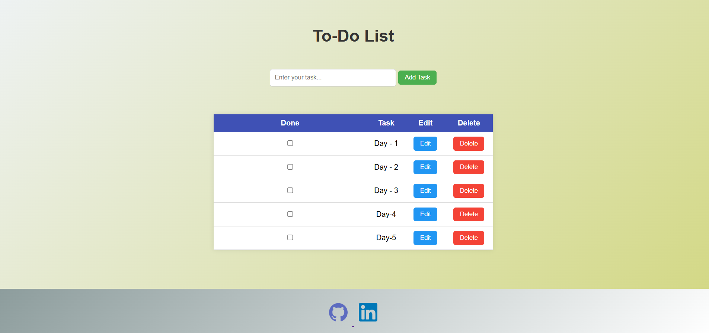
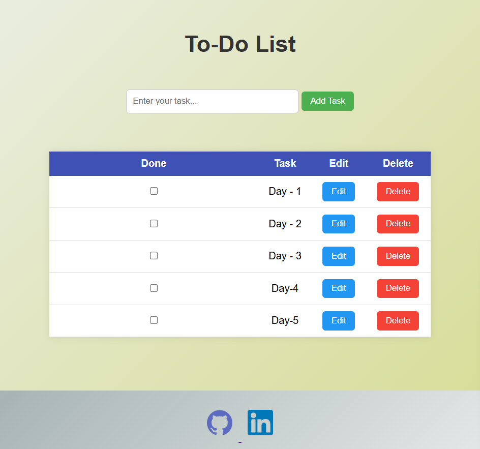
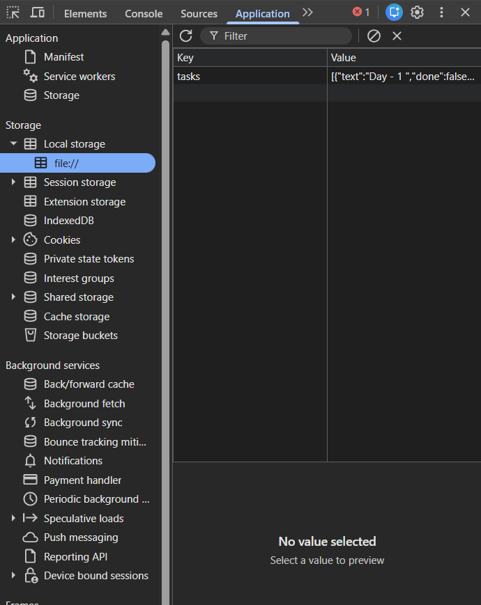

# Todo-list-app
A simple and responsive Todo Web App built using HTML, CSS, and JavaScript. Users can add, edit, delete, and mark tasks as completed with data saved in LocalStorage.
## LIVE DEMO  : https://todo-list-appproject.netlify.app/
## Features

- Add tasks
- Edit tasks
- Delete tasks
- Mark tasks as completed
- Data saved using LocalStorage
- Clean and simple UI

## Technologies Used

- HTML
- CSS
- JavaScript

## Project Structure

```
index.html
style.css
script.js
```
## 📸 Project Preview

<p align="center">
   </p>
 <p align="center">  </p>
  <p align="center">  </p>
</p>
How to Use

1. Enter a task in the input box
2. Click **Add Task** or press **Enter**
3. Use Edit or Delete buttons to manage tasks

## Author

Nirav Hingu

GitHub: https://github.com/niravhingu  
LinkedIn: https://linkedin.com/in/nirav-hingu
